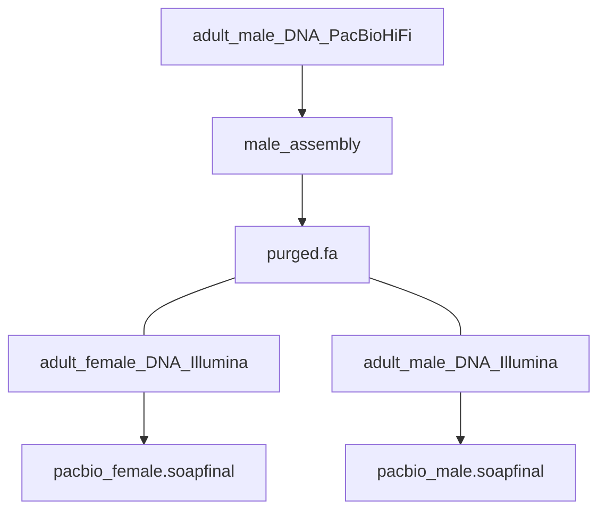

# test

```mermaid
  info
```

```mermaid
graph TD;
    A-->B;
    A-->C;
    B-->D;
    C-->D;
```

```mermaid
graph TD;
    adult_male_DNA_PacBioHiFi-->male_assembly;
    male_assembly-->purged.fa;
    purged.fa---adult_female_DNA_Illumina;
    purged.fa---adult_male_DNA_Illumina;

    adult_female_DNA_Illumina-->pacbio_female.soapfinal;
    adult_male_DNA_Illumina-->pacbio_male.soapfinal;
```
